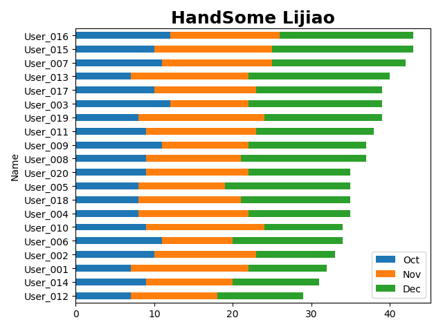
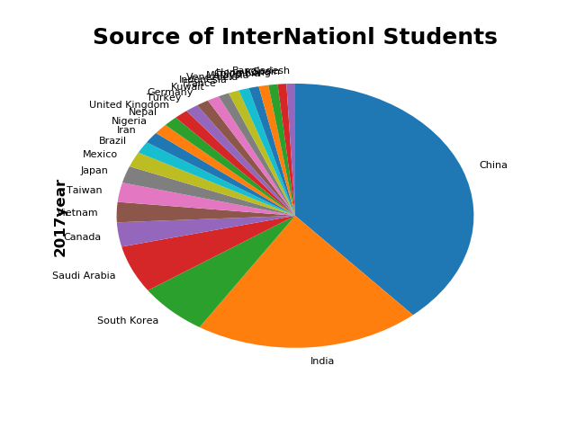

# pandas 操作Excel(笔记)
----------
## 1、pandas读取任意位置数据
```python
books = pd.read_excel('c:/Temp/Books.xlsx',skiprows=3,usecols="C:F")
print(books)
```
## 2、pandas自定义填充序列号
```python
books = pd.read_excel('c:/Temp/Books.xlsx',skiprows=3,usecols="C:F",index_col=None,dtype={'ID':str})
for i in books.index:
    books['ID'].at[i] = i+1
print(books)
```
特别注意：Nan默认为float浮点数，需要将其转换为str字符串类型，不然ID不能取整。
## 3、日期累加计算
+ 年
```python
 books['Date'].at[i] = date(start.year + i,start.month,start.day)
```
+ 月
```python
 def add_month(d,md):
  yd = md // 12
  m = d.month + md % 12
  if m != 12:
      yd += m // 12
      m = m % 12
  return date(d.year + yd,m,d.day)
# 计算月份算法
 books['Date'].at[i] = add_month(start,i)
```
+ 日
```python
books['Date'].at[i] = start + timedelta(days = i)
```
## 4、Excel技巧
+ 设置INDEX列
```python
books.set_index('ID',inplace=True)
```
+ 列和列之间的运算
```python
books['Price'] = books['ListPrice'] * books['Discount'] #乘法
books['Price'] = books['ListPrice'] + 2  #加法
```
+ 单列排序和多列排序
```python
products.sort_values(by ='Worthy',inplace = True,ascending = False)  # 单列排序
```
```python
products.sort_values(by =['Worthy','Price'],inplace = True,ascending = [True,False])  # 多列排序，并按照不同的升降序排列
```
+ 数据筛选
```python
def age_18_to_30(a):
    return 18<=a<30

def level_a(s):
    return 85<=s<=100
# 定义不同的函数设定筛选条件

Students = Students.loc[Students['Age'].apply(age_18_to_30)].loc[Students['Score'].apply(level_a)]  #loc多重过滤
Students = Students.loc[Students.Age.apply(age_18_to_30)].loc[Students.Score.apply(level_a)]  #loc多重过滤另外一种写法
Students = Students.loc[Students.Age.apply(lambda a:18<=a<30)].loc[Students.Score.apply(lambda s:85<=s<=100)]  #loc多重过滤LAMBDA表达式写法（不调用函数）
```
代码太长的解决办法，输入<kbd>Space</kbd>+<kbd>/</kbd>可以换行，不影响代码运行。
+ pandas读取Excel表格数据并并排序，然后用matplotlib制图
```python
students.sort_values(by='Number',inplace=True,ascending=False)  #排序并修改原始DF
students.plot.bar(x='Field',y='Number',color='orange',title='HandSome Lijiao')  # 按照字段绘制图形(控制颜色)
plt.tight_layout()  # 紧凑型布局
plt.show()
```
```python
plt.bar(students.Field,students.Number,color='orange')
plt.xticks(students.Field,rotation = '90')
plt.xlabel('Field')
plt.ylabel('Number')
plt.title('HandSome Lijiao',fontsize = 16)
plt.tight_layout()  # 紧凑型布局
plt.show()
#另外一种写法，用matplotlib直接绘制，稍微灵活一点
```
+ 分组柱图深度解析
```python
students.sort_values(by='2017',inplace=True,ascending=False)
print(students)
students.plot.bar(x='Field',y=['2016','2017'],color = ['orange','red'])
plt.title('InterNational students',fontsize = 18,fontweight = 'bold')
plt.xlabel('Field',fontweight = 'bold')
plt.ylabel('Number',fontweight = 'bold')
ax = plt.gca()  # 轴的控制点
ax.set_xticklabels(students['Field'],rotation = '45',ha = 'right') # ha旋转中心点
f = plt.gcf()  # 图形的控制点
f.subplots_adjust(left=0.2,bottom=0.42) #左边留出20%，下面留出42%
# plt.tight_layout()
plt.show()
```
+ 分组柱状图内嵌并排序
```python
users['Total'] = users['Oct']+users['Nov']+users['Dec']
users.sort_values(by='Total',inplace=True,ascending=True)
users.plot.barh(x='Name',y=['Oct','Nov','Dec'],stacked = True)  # stacked = True条状图，users.plot.barh横状图
plt.title('HandSome Lijiao',fontsize =18,fontweight ='bold')
plt.tight_layout()
plt.show()
```
最后运行图示：  


+ 饼图绘制
```python
# students.sort_values(by='2017',inplace=True,ascending = True) # 排序从小到大
print(students)  
# students['2017'].plot.pie(fontsize = 8,startangle=-270)  # 饼图里面的小文字,startangle=-270定义起始点角度
students['2017'].plot.pie(fontsize = 8,counterclock=False,startangle=-270) #可以不用排序，直接生成需要的图，第二种办法
plt.title('Source of InterNationl Students',fontsize=18,fontweight='bold')
plt.ylabel('2017year',fontsize = 12,fontweight= 'bold')  # Ylabel重写格式
plt.show()
```
最后运行图示：  

